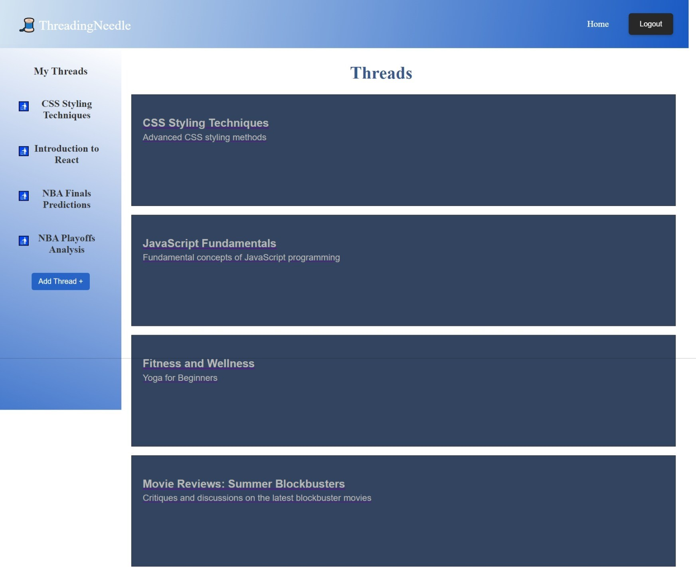

# Threading Needle

## Description
Threading Needle is a vibrant online platform that draws inspiration from Reddit's dynamic community-driven model. It serves as a hub for diverse discussions, content sharing across various interests, and fostering meaningful community interactions. With a focus on modern web technologies, Threading Needle provides users with an engaging and interactive environment where they can explore a wide range of topics, connect with like-minded individuals, and contribute to an ever-evolving digital community.

## Features
1. JWT Authentication: Ensuring secure user authentication through JSON Web Tokens, enhancing privacy and access control.
2. React Frontend: Providing a dynamic, responsive, and user-friendly interface powered by React, offering seamless navigation and interactivity.
3. MongoDB Database: Efficiently managing and storing data using MongoDB, enabling scalability and robust data handling capabilities.
4. CSS Styling: Creating an aesthetically pleasing and intuitive user experience with carefully crafted CSS styles, enhancing visual appeal and usability.
5. GraphQL API: Optimizing data fetching and manipulation through a GraphQL API, enabling efficient and precise queries and mutations for enhanced performance and flexibility.

## Technologies Used
* Bcrypt
* JSON Web Tokens
* Apollo GraphQL
* GraphQL
* Mongoose
* NodeMon
* React-Bootstrap

## Credits 
Mathues Almeida

## License
This project is licensed under the MIT License.
